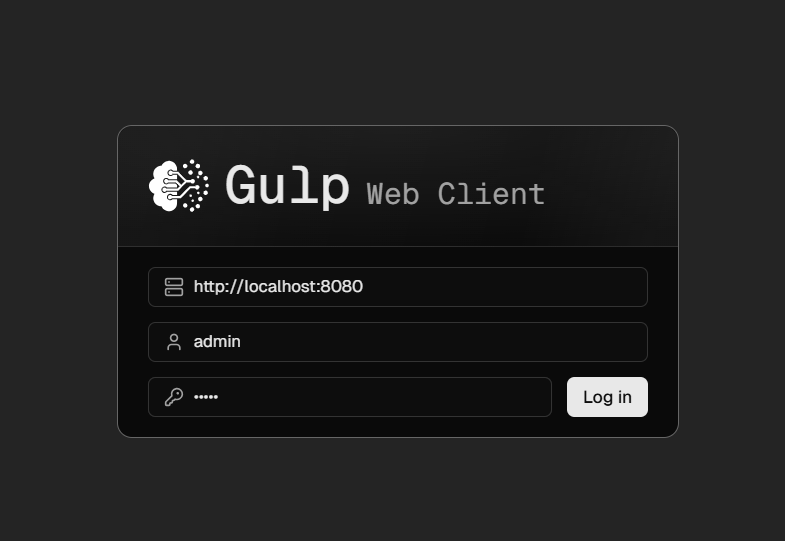
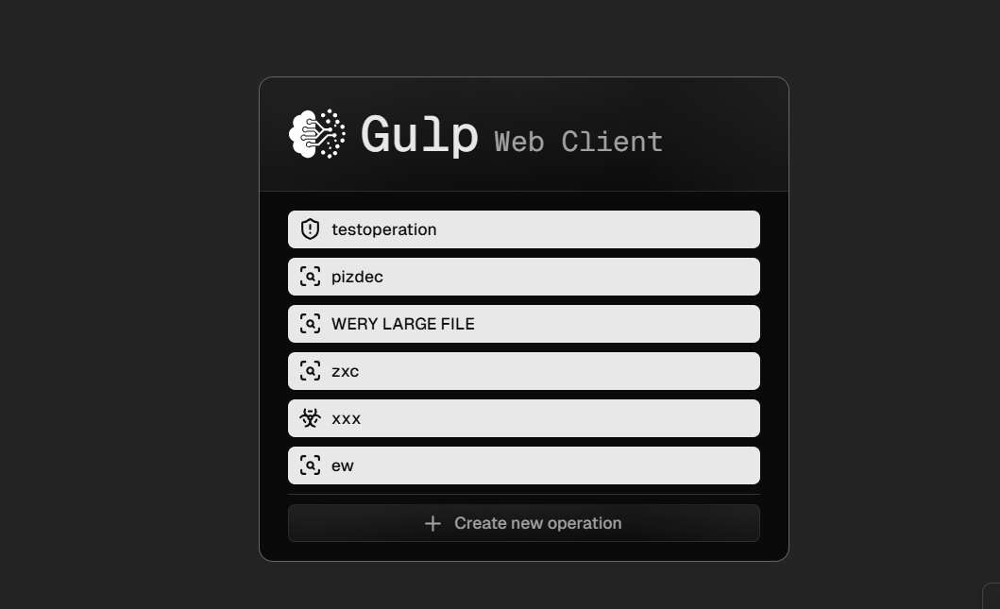
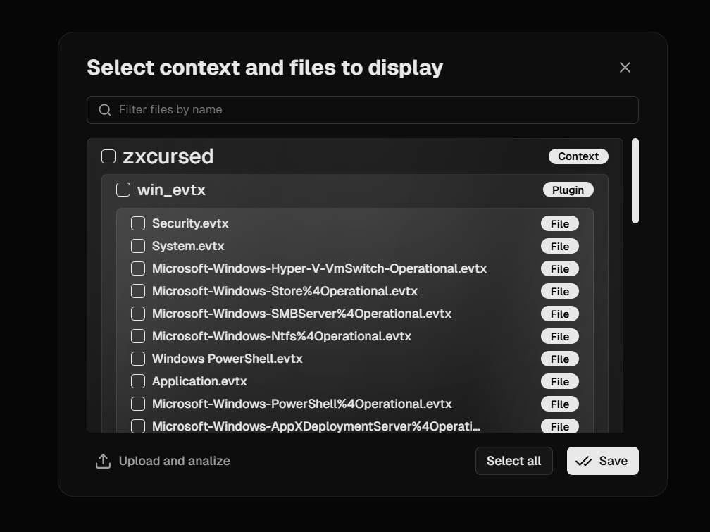
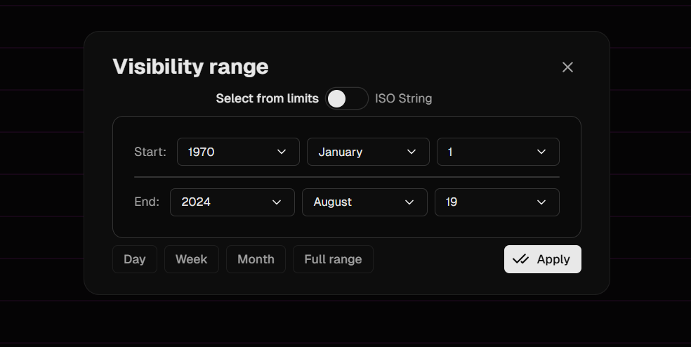
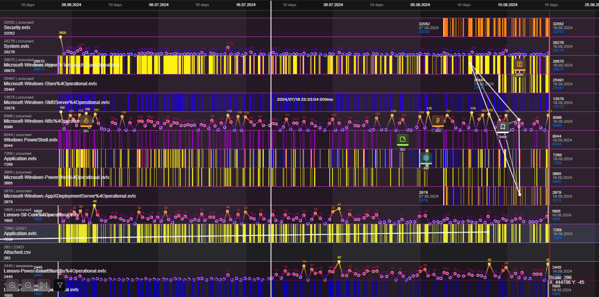
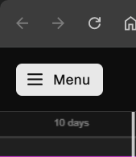
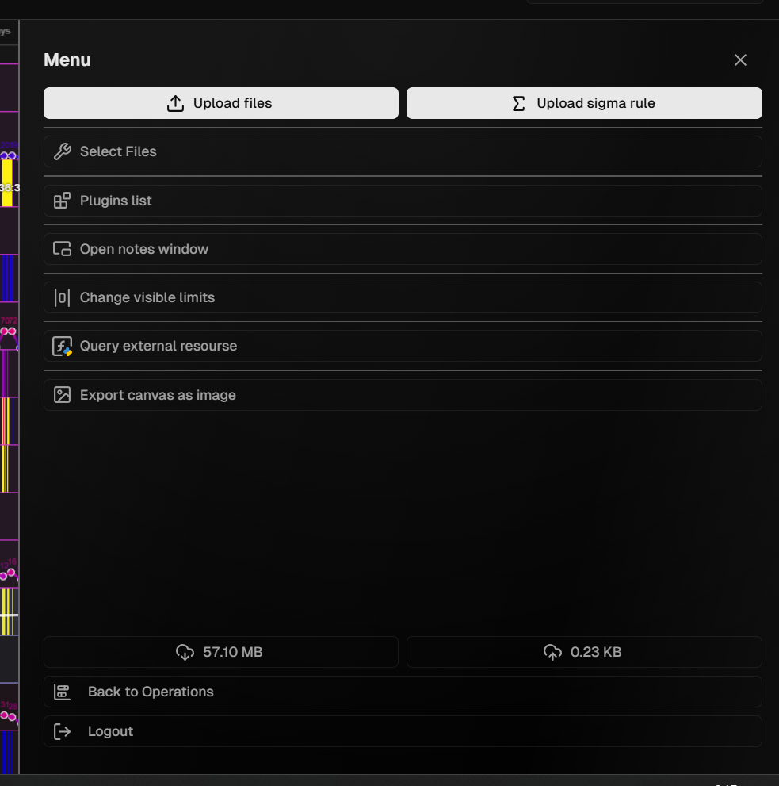
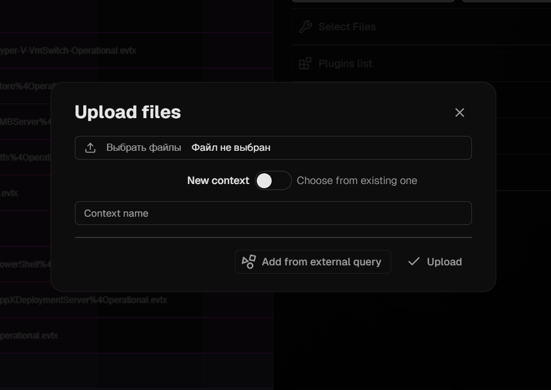
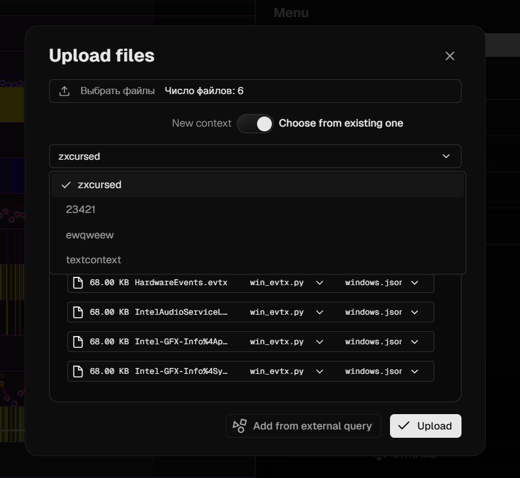

# Introduction

**Gulp UI Web** is a browser-based application designed for analyzing and interacting with the backend of Gulp. It is built using React and the Shadcn/UI libraries.

**Documentation**:
1. [Setup Instructions](./docs/SETUP.md)
2. [Minimum Requirements](./docs/SETUP.md)
3. [Workflow Overview](#Workflow)
   1. [Authorization](#Authorization)
   2. [Timeline](#Timeline)
   3. [Upload Files](#Ingest-files)

# Workflow

## Authorization

### Authentication
Log in to the application as described in the [Setup Instructions](./docs/SETUP.md). Upon opening the web interface, you will see the login page requiring a username, password, and the Gulp server URL, as shown in **Figure 1**:

   

### Select Operation
After successful authentication, an operation selection screen will appear, as shown in **Figure 2**:

   

### Select Files
At this stage, you can select contexts (groups), plugins (categories), and files (documents) for display. You can modify your selection later via the [application menu](#Menu). The "Upload and Analyze" button allows you to open the [Ingest File](#Ingest-file) banner to upload and process [files](./docs/DEFINITIONS.md#file). You can also choose all contexts, plugins, or files individually or collectively by clicking "Select All," as shown in **Figure 3**:

   

### Set Visibility Range
Using the provided interface, you can adjust the time range for data displayed on the [Timeline](#Timeline).

**Available Options:**
1. Last day from the most recent log
2. Last week from the most recent log
3. Last month from the most recent log
4. Entire period

For finer control, switch to "ISO String" mode for custom date selection, as explained in [ISO 8601](https://en.wikipedia.org/wiki/ISO_8601).

   

### Timeline

The timeline visualization provides a structured view of system log data over a defined period. Each horizontal row corresponds to a specific log file or data source, showcasing activity through color-coded bars and graphical overlays. This feature helps analyze system events, correlations, and trends across multiple data streams.

#### Components

1. **Time Scale**
   - Located at the top, it divides the timeline into intervals (e.g., 10-day spans).
   - Facilitates precise navigation and event identification within the selected period.

2. **Rows and Data Sources**
   - Each row corresponds to a specific log file (e.g., `Security.evtx`, `System.evtx`).
   - The log file name and unique identifier are displayed on the left side.

   **Example Rows:**
   - `Microsoft-Windows-Ntfs%4Operational.evtx` logs file system operations.
   - `Security.evtx` records security-related events.

3. **Color-Coded Activity**
   - **Yellow Bars:** Indicate significant or high-intensity activity.
   - **Purple Bars:** Represent less intensive or background processes.

   This differentiation highlights priority areas for investigation.

4. **Graphical Overlays**
   - Lines with nodes and numerical labels represent metrics (e.g., event counts).
   - Peaks and valleys highlight fluctuations in activity.

   **Example:** A peak labeled `2625` in `Microsoft-Windows-Ntfs%4Operational.evtx` indicates a high volume of events.

5. **Event Markers**
   - Icons pinpoint specific events or milestones.
   - Custom markers denote key system states or anomalies.

   **Example:** A marker at `2024/07/18` aligns peaks in `System.evtx` and `Microsoft-Windows-SMBServer%4Operational.evtx`.

#### Use Cases

- **Anomaly Detection:** Identify unusual spikes or dips in activity.
- **Correlation Analysis:** Explore relationships between events across different logs.
- **Performance Monitoring:** Track recurring patterns to optimize performance.

#### Example Interpretation

1. **High Activity Periods:**
   - `Security.evtx` shows intense yellow bars in early August 2024, indicating a potential security incident.

2. **Co-occurring Events:**
   - A vertical marker highlights synchronized activities between `Microsoft-Windows-Hyper-V-Switch-Operational.evtx` and `System.evtx`.

3. **Specific Metrics:**
   - Peaks in `Microsoft-Windows-Ntfs%4Operational.evtx` suggest periodic file system operations.

   

## Menu

The application menu is accessible via the "Menu" button located at the top of the application, as shown in **Figure 5**:

   

Clicking it opens the settings interface, shown in **Figure 6**.

### Key Options:
1. [Upload Files](#Ingest-files)
2. Upload Sigma Rule
3. [Select Files](#Select-files)
4. Open Notes Window
5. [Change Visible Limits](#Set-visibility-range)
6. Query External Sources
7. Export Canvas as Image

### Debugging Information:
1. Data sent since session start
2. Data received since session start

### Additional Options:
1. [Back to Operations](#Select-operation)
2. Logout

   

## Ingest Files

The interface for uploading files to the Gulp backend for further analysis.

At the top, there is a button to open a file selection dialog for upload. Below it, a toggle allows you to either create a new [context](./docs/DEFINITIONS#context) or add [files](./docs/DEFINITIONS.md#file) to an existing one if enabled.

   

Here is how the completed upload appears:

   

## Storyline

   

The interface of all created notes and links, displayed in frame-stack, with ability to change notes and links.

1. Right-click on note/link to edit
2. Left-click on note/link to opendetails

To change visibility `(show/hide)` of note/link, toggle switch below at corresponding window.

### Addictional Options:
1. Export notes and links, with detailed events in JSON format
2. Export storyline as png picture

### Accessing Internal Logs
To access internal logs, open the command line interface (CLI) by pressing `/`. This opens a console displaying all logs generated by the program for inspection and debugging.

### Exporting Logs for Bug Reporting
To report a bug or issue, export all logs into a file for attachment to a GitHub issue.

1. Press `F8` to open the command line.
2. Type `export` and press Enter.
3. The logs are saved to a file named `gulpui-web_log_timestamp.log`.
4. Include this file when creating a GitHub issue to provide valuable context for developers.
