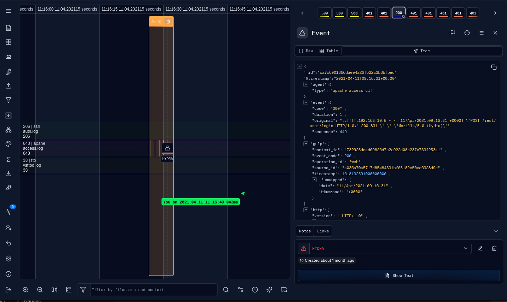

# gulpui-web

gulpui-web is the browser frontend for gULP. It is a React and TypeScript
application for connecting to a gULP backend, selecting investigation operations,
ingesting sources, exploring event timelines, filtering data, enriching events,
and exporting analyst work.


## Documentation

This root README is the main documentation entry point. Detailed sections live in
`docs/`:

- [Definitions](docs/DEFINITIONS.md)
- [Installation](docs/installation.md)
- [Ingestion](docs/ingestion.md)
- [Flow](docs/flow.md)
- [Features](docs/features.md)
- [Filters](docs/filters.md)
- [External Integrations](docs/external.md)
- [Plugins](docs/plugins.md)
- [Engine](docs/engine.md)
- [View](docs/view.md)

## Quick Start

Install dependencies:

```bash
pnpm install
```

Run the development server:

```bash
pnpm start
```

Build for deployment:

```bash
pnpm run build
```

Serve the production build:

```bash
pnpm run server
```

If pnpm blocks dependency build scripts, approve the required scripts:

```bash
pnpm approve-builds
```

See [Installation](docs/installation.md) for full setup details.

## Main Workflow

1. Log in with a backend server URL, username, and password.
2. Select or create an operation.
3. Select existing contexts and sources, load a saved session, or ingest new
   files.
4. Set the timeline frame and inspect events.
5. Use notes, links, filters, enrichment, external queries, dashboards, and
   plugins to complete the investigation workflow.



## Image Policy

Current documentation screenshots are stored in `docs/images/`. Images outside
that folder are legacy assets and should not be used for current workflow docs.
