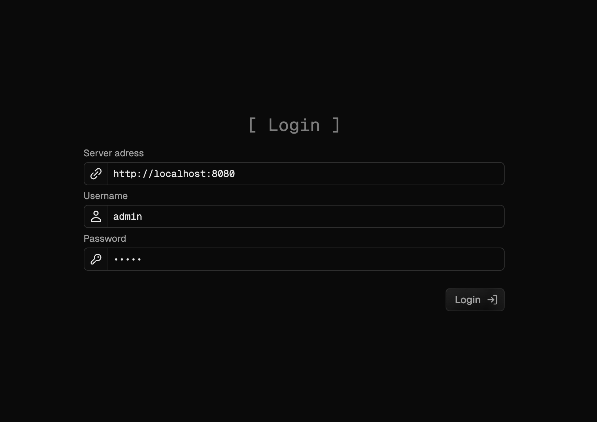
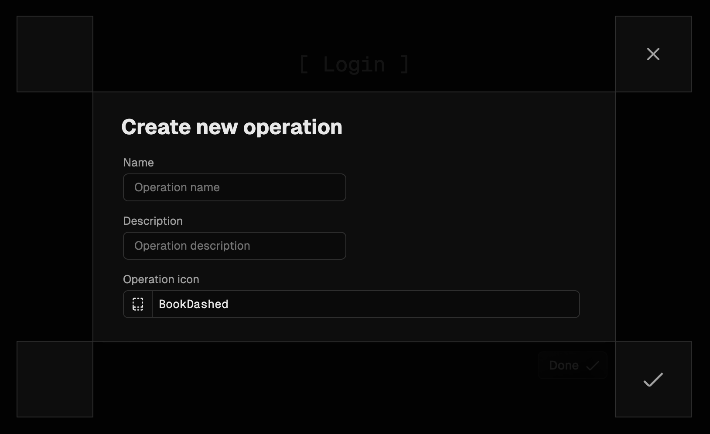
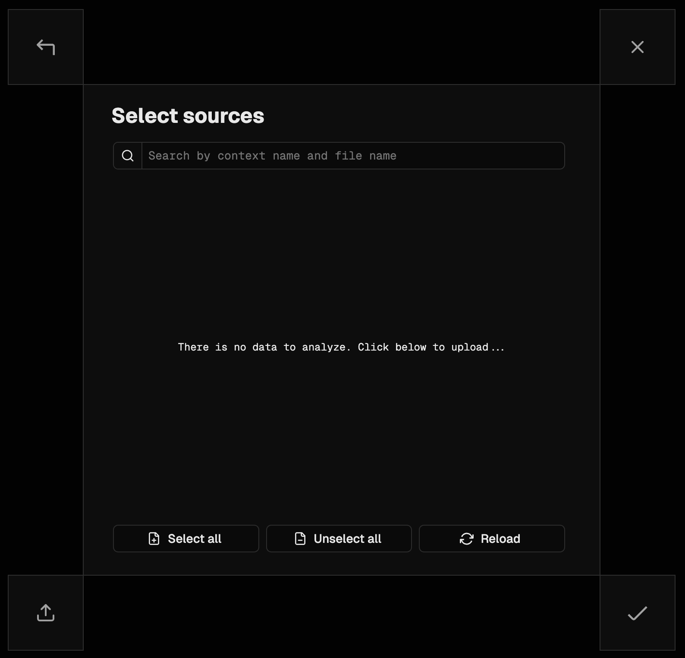

# Introduction

**Gulp UI Web** is a browser-based application designed for analyzing and interacting with the backend of Gulp. It is built using React and the Shadcn/UI libraries.

**Documentation**:
1. [Setup Instructions](./docs/SETUP.md)
2. [Minimum Requirements](./docs/SETUP.md)
3. [Authentication](#authentication)
4. [UX Documentation](./docs/ux_docs/UX_WORKSPACE.md)

---

## Authentication

The **authentication screen** is the entry point to Gulp Web Client. It allows users to connect to a server and manage sessions.

<div  align="center">
  
</div>

---

## Registration and Login

The start page provides three input fields:
- **Server URL** — the address of the Gulp backend server.
- **Username** — user login.
- **Password** — user password.

#### Example
```
Server address: http://localhost:8080 
Username: admin  
Password: admin  
```

> **Note**  
> If your backend is served under `/api`, make sure to include `/api` in the **Server URL**.  

---

## Login Button

Once the **Server address**, **Username**, and **Password** fields are filled in, press **Login**:
1. The client attempts to connect to the backend.
2. If the connection or authentication fails, an error message is displayed.
3. If the login is successful:
    - You can **choose an existing operation** or **create a new one**.
    - You can **select a saved session**, **continue without a session**, or **start a new session**.

---

#### Creating a New Operation

When creating a new operation, a **popup window** appears containing:

- **Operation Name** — input field for the operation title.
- **Description** — input field for a brief description of the operation.
- **Icon Selection** — choose an icon to represent the operation.

<div align="center">
  
</div>

#### After creating the operation:

- A new window opens where you can **attach logs**, **select data sources**, or **manage existing items** related to the operation.
- You can also **delete the operation** if needed.

<div align="center">
    
</div>

> **Tip**  
> This flow allows you to quickly set up a new operation and immediately start working with its data and logs.

---

#### Session Management
- Sessions are saved automatically after login.
- This allows you to **return to unfinished operations** or **switch between tasks** later.

> **Note**  
> There is no need to manually create or select a session — the client handles it automatically.

---

## Next Steps

After completing `authentication` and getting familiar with the workspace, you can continue exploring other features of the Gulp Web Client:

- Learn how to manage and run **operations**.
- Extend functionality with **[plugins](/docs/PLUGINS.md)**.
- Explore the full **[UX Workflows](./docs/ux_docs/UX_WORKSPACE.md)** for detailed workflows.