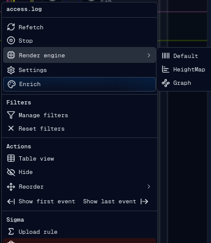

# Engine

The render engine controls how each source row is drawn on the timeline canvas.
Source settings also control offset, sampling, colors, and field hashing.

## Render Engines

gulpui-web has three source render engines:

- `Default`: draws event activity as one-pixel vertical bars colored from the
  configured hash field.
- `HeightMap`: groups events into fixed one-minute buckets and draws vertical
  bars proportional to event density.
- `Graph`: aggregates source sample data into dynamic buckets, draws a semi-log
  density graph, and connects graph points.

The source context menu can switch engines directly.

## Source Settings

The source settings banner is opened from the source context menu. It saves
settings through the frontend source settings flow and refreshes rendering.

Configurable source settings:

- timestamp offset in milliseconds;
- minimum frequency sample for graph rendering;
- render engine;
- hash function used for event value coloring;
- render color palette;
- event field used for the color scheme;
- context color.

If a knowledge-base color override or custom palette is applied, source settings
can show the active override and allow clearing it.

## Timestamp Offset

Offset shifts a source's rendered event timestamps without changing the original
event data. This is useful when a source clock is known to be ahead or behind the
operation timeline.

Offset is stored in milliseconds and applied during rendering, event hit testing,
note positioning, and timeline targeting.

## Frequency Sample

The Graph engine uses `frequency_sample` as the minimum sample size. When zoomed
out, the engine dynamically increases the sample rate based on visible time range
and canvas width to avoid excessive overlap and keep rendering performant.

## Colors and Fields

Default and HeightMap rendering resolve colors from the selected palette and the
configured event field. The hash function converts field values into stable
numeric values for palette lookup. Explicit color overrides can replace palette
colors for selected field values.

Context color is used as the row tint and separator color so related sources can
be visually grouped.

## Caching

RenderEngine and its sub-engines cache per-source render data. Caches are reset
when notes, flags, source settings, operation context, or selected data changes
require a redraw.
