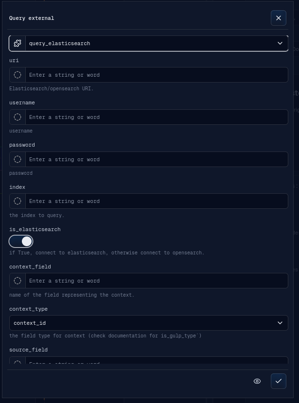
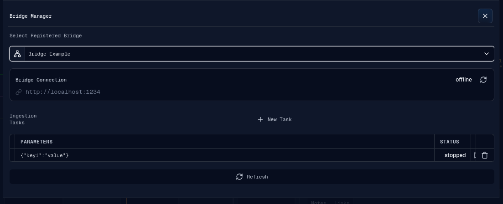

# External Integrations

The External menu contains Query External, Bridge Manager, and Data Enrichment.
Enrichment is documented in [Features](features.md#enrichment). This page covers
Query External and Bridge Manager.

## Query External Source

Query External runs backend-provided plugins whose type includes `external`.

The banner supports:

- external plugin selection;
- dynamic request fields based on the selected plugin's custom parameters;
- advanced plugin parameters through the shared Advanced Plugin Params editor;
- optional raw query JSON;
- optional query options JSON;
- preview mode;
- run mode.

Preview mode opens a Preview banner with returned documents and total hits. Run
mode executes the external query and then opens source selection so newly created
or updated sources can be selected into the operation context.

## Bridge Manager

Bridge Manager works with registered ingestion bridges.

The Bridge Manager banner supports:

- loading the registered bridge list;
- selecting a bridge;
- viewing bridge URL and current status;
- refreshing bridge status;
- listing ingestion tasks for the selected bridge and current operation;
- creating a new task with plugin parameters;
- starting stopped tasks;
- stopping ongoing tasks;
- deleting tasks;
- refreshing the task table.

Bridge status and task lifecycle details depend on backend bridge availability.
This documentation only covers the frontend workflow and visible controls.
