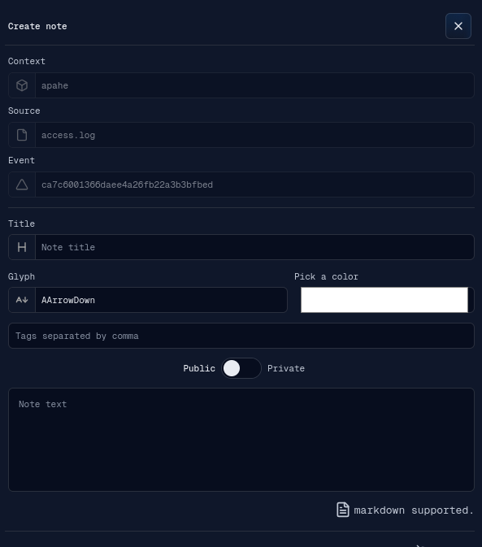
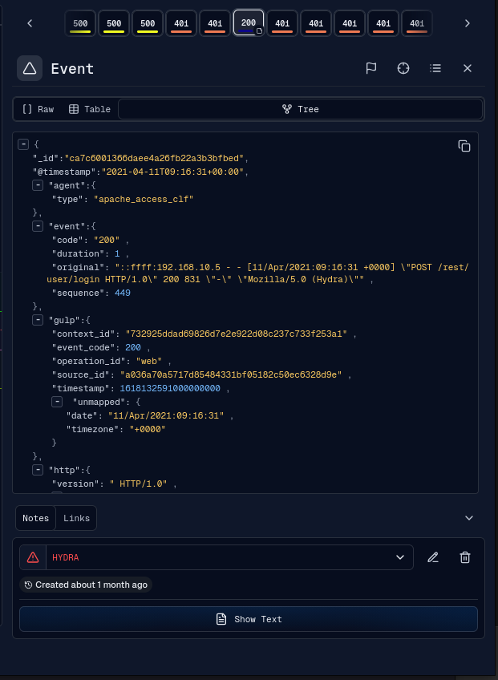
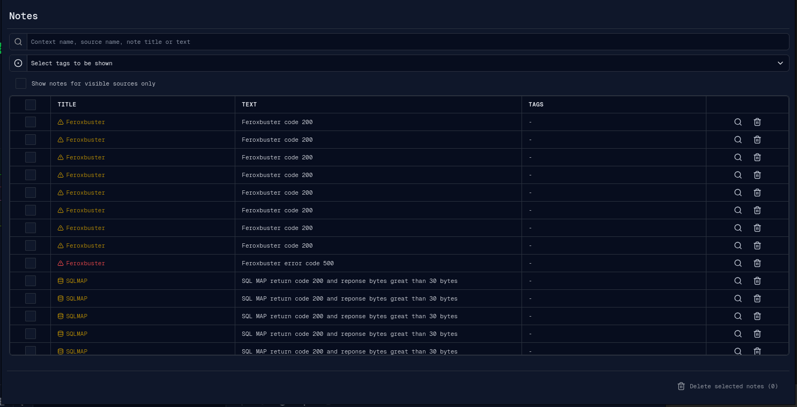
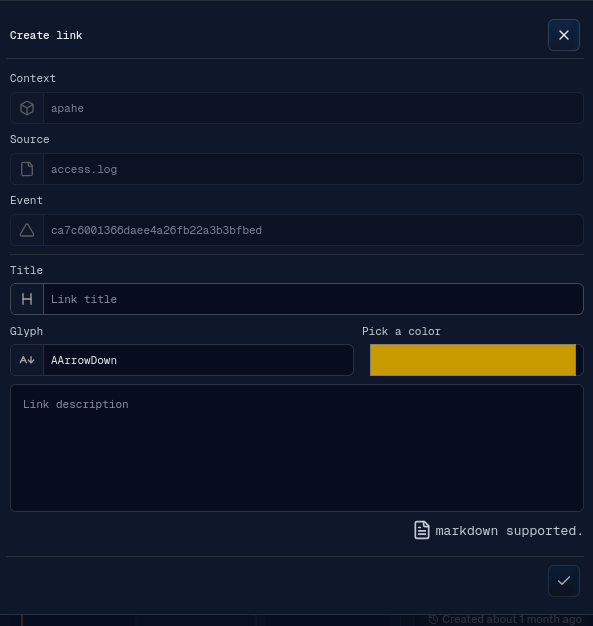
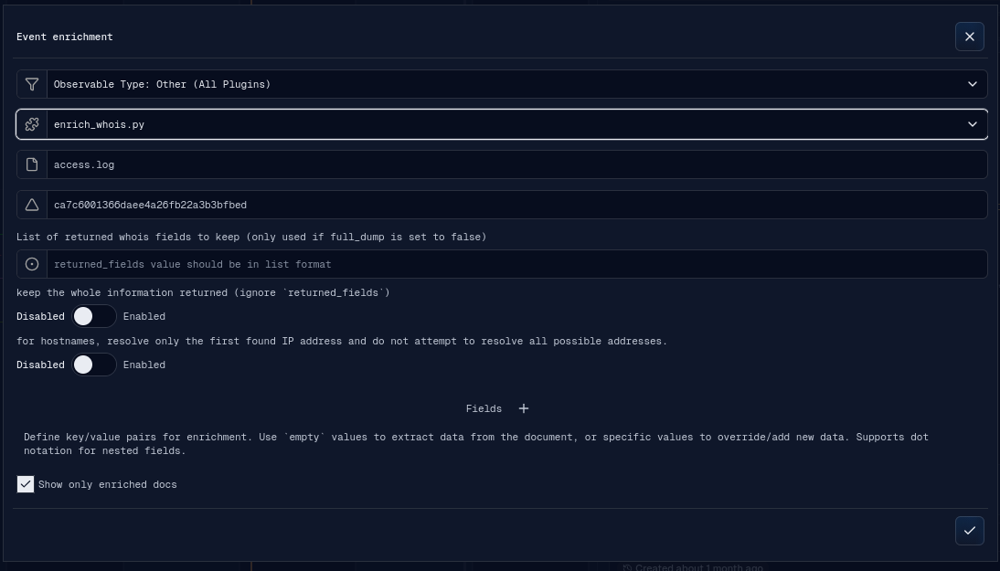
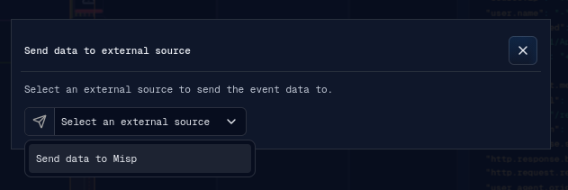

# Features

This section covers the analyst collaboration and enrichment features: notes,
links, enrichment, and Send IOC.

## Notes

Notes attach analyst context to one or more events. They are visible in the event
detail panel and can be shown on the timeline as markers.

A note contains:

- target context, source, and event;
- title;
- glyph;
- color;
- comma-separated tags;
- public or private visibility when creating a new note;
- markdown-supported note text.

The event detail panel shows notes in the lower `Notes` tab. Existing notes can
be edited or deleted from the event panel.

The detached Notes window lists operation notes in a table.

The Notes window supports:

- search by context name, source name, note title, or text;
- tag filtering;
- "visible sources only" filtering;
- selecting notes;
- bulk deletion;
- targeting a note to open or fetch its event in the main tab.

## Links

Links connect related events. They let an analyst represent relationships such as
cause/effect, repeated activity, or a meaningful investigative sequence.

A link contains:

- target context, source, and event;
- title;
- glyph;
- color;
- markdown-supported description.

The event detail `Links` tab lists connected links. From that tab an analyst can
open connected events, disconnect the current event from a link, or delete the
link. A link can also be connected to additional events through the Connect Link
banner.

## Enrichment

Enrichment uses backend-provided enrichment plugins to add context to an event or
source range.

The enrichment banner supports:

- observable type selection, with automatic type detection when opened from an
  event field;
- enrichment plugin selection;
- source selection or a fixed event target;
- event ID or source time range;
- plugin custom parameters;
- key/value fields to extract from the document or override manually;
- a "show only enriched docs" option for source-range enrichment.

From an event detail view, selecting a field or selection can prefill the
enrichment key/value input. From the operation menu or source context menu,
enrichment runs against a selected source and frame range.

## Send IOC

Send IOC is exposed from the event detail action menu when at least one UI plugin
targets the `send-data` slot.

The Send Data plugin supports:

- sending a simple IOC from event data;
- sending a structured object (defined by plugin);
- setting event/object fields in the plugin UI;
- receiving async success or failure feedback through WebSocket messages.

The Send IOC parent banner does not implement destination-specific behavior. It
loads the selected plugin and calls the plugin's `onDone()` ref method when the
analyst confirms the action.
