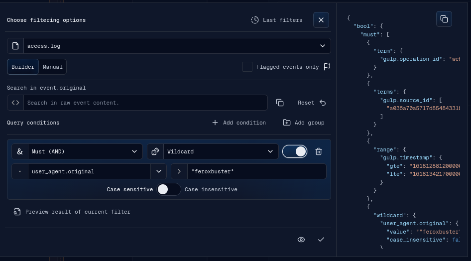
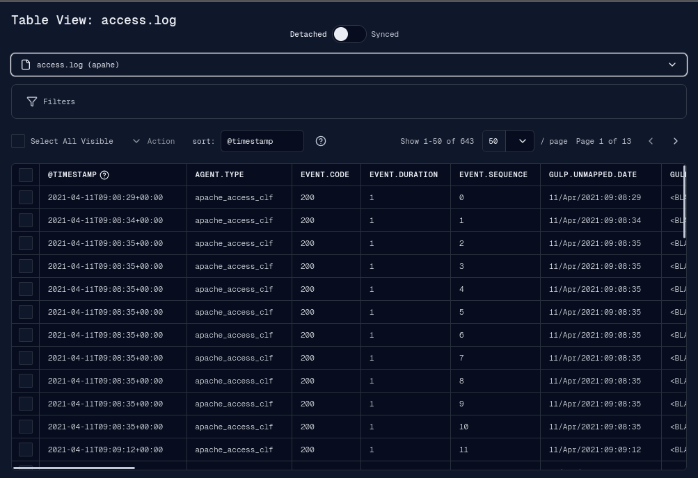
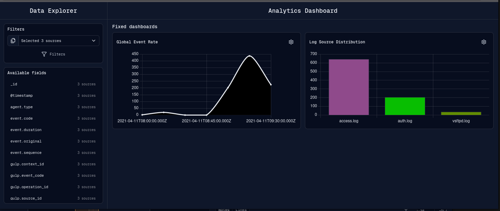

# Filters

Filters narrow source events in the timeline, table view, previews, and dashboard
queries. The main filter UI is the Apply Filters banner.

## Scope

A filter is applied to one or more sources. The banner starts with the selected
sources passed from the operation menu, source context menu, or previous filter
history. Source changes update the query scope.

When filters are applied, the frontend caches the current source events for undo,
stores the query against each selected source, refetches those sources, and
triggers a timeline render.

## Builder Mode

Builder mode provides:

- source multi-select;
- text filtering;
- condition groups;
- field selectors loaded from selected source event keys;
- generated OpenSearch query preview;
- optional "flagged only" preview mode.

The query display label is generated from the actual filter state. It is not used
as the filtering source of truth.

## Manual Mode

Manual mode exposes a raw JSON editor for advanced OpenSearch queries. If manual
JSON is invalid when applying or previewing, the UI rejects the action. A reset
action can regenerate a clean query from the current sources and timeline frame.

Changing source selection in manual mode resets the generated query to avoid
stale source IDs or ranges.

## Preview

Preview runs the current query without committing it to the timeline. Results
open in a Preview banner. Returning from preview restores the filter banner with
the current query, source selection, notes settings, and field keys.

## Last Filters

The Last Filters popover loads recent query history from the backend. A historical
filter can be applied with its saved source scope or adapted to the currently
selected sources.

## Apply, Reset, and Undo

Apply saves the final filter and refetches selected sources. Reset removes active
filters for a source and refetches it. Undo is available when the timeline cache
contains previous data for the source.

Source context menu filter actions:

- Manage filters;
- Reset filters;
- Undo last filters change when cached data exists.

## Table View Filters

The Table View window supports its own filter panel. In synced mode, it follows
the global source filters and timeline range. In detached mode, it uses local
search, local filters, date range controls, sorting, and pagination.

## Dashboard Filters

The Dashboard window has a Data Explorer filter area. It can use selected sources,
time range, text filter, and structured conditions to build dashboard queries.

