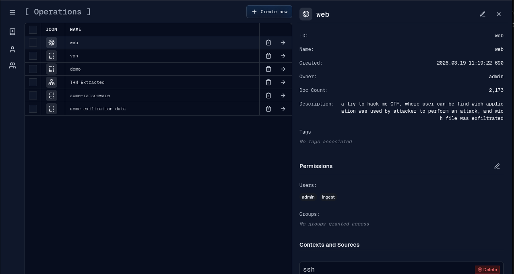
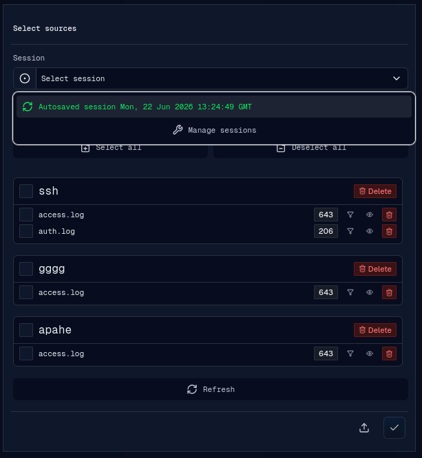
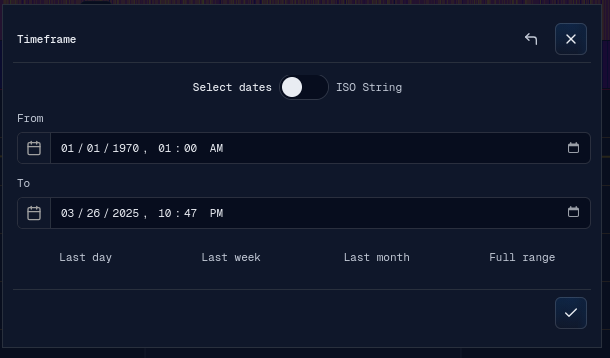
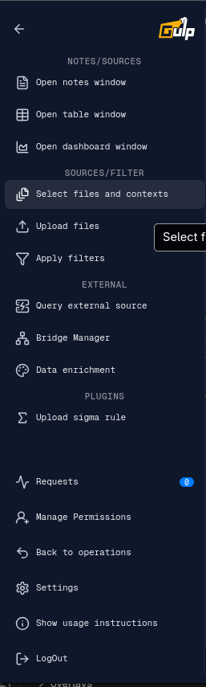
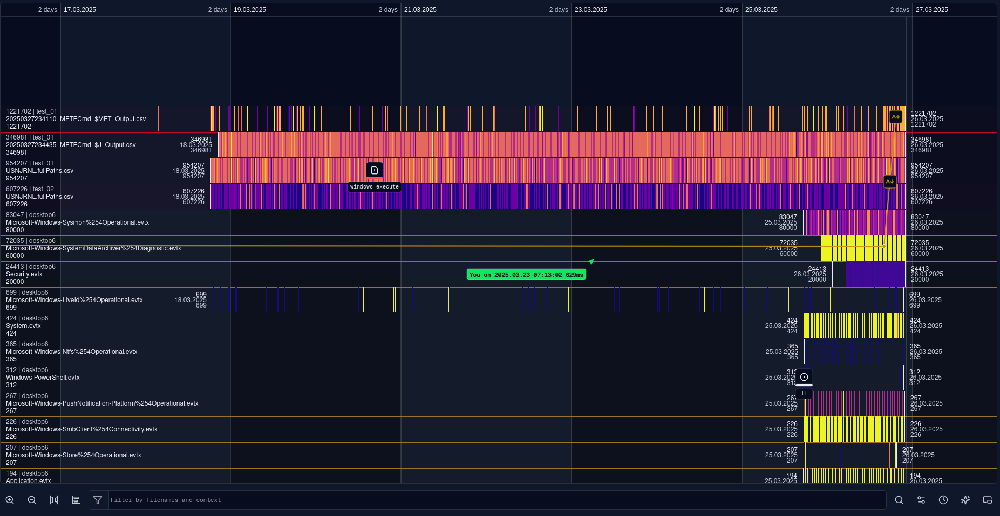
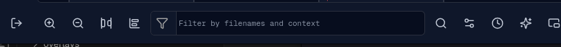

# Flow

The operation flow starts from the operations page, moves through source/context
selection, and ends in the timeline workspace where events are investigated.

## Operations

An operation is the investigation workspace. The operations page lets an analyst:

- create a new operation;
- select an existing operation;
- inspect operation metadata, document count, permissions, contexts, and sources;
- delete operations or sources when permitted.

After an operation is selected, gulpui-web opens the operation route and checks
whether sources are already selected or whether a saved session should be loaded.

## Operation Context

The operation context is made from selected contexts and sources. A context is a
logical grouping, usually a host or investigation container. A source is a log or
event collection inside that context.

The source selection banner supports:

- loading an autosaved or manually saved session for the operation;
- selecting or deselecting all visible sources;
- selecting a complete context;
- selecting individual sources;
- filtering the visible context/source list;
- refreshing operation data from the backend.

When the selection is saved, the app updates the main timeline, autosaves the
session, and replays the selection to detached windows.

## Timeline Frame

After source selection, the frame banner sets the visible time range. The frame
can be entered with date inputs or ISO strings and can be quickly set to common
ranges such as the last day, week, month, or full range.

The selected frame is used for timeline rendering, refetching selected sources,
filters, enrichment ranges, table view defaults, and dashboard defaults.

## Workspace Menu

The left menu groups operation actions by area.

Top menu sections:

- Notes/Sources: open Notes, Table View, and Dashboard detached windows.
- Sources/Filter: select sources, upload files, and apply filters.
- External: query external sources, manage bridges, and run enrichment.
- Plugins: built-in and backend-provided UI plugins for the operation menu.

Bottom menu actions:

- requests;
- permission management;
- back to operations;
- settings;
- usage instructions;
- logout/session save.

## Timeline Sources

Selected sources are displayed as rows in the timeline. Each row belongs to a
context and shows event activity across the active frame.

Source rows support:

- right-click context menu actions;
- render engine switching;
- source settings;
- enrichment;
- filter management;
- table view opening;
- hide, pin, move up, and move down;
- first/last event navigation.

## Timeline Navigation

The bottom toolbar contains timeline navigation and display controls.

Available controls include zoom, scale reset/navigation tools, filename/context
filtering, search, filter controls, frame/time controls, note/link overlays, and
detached or auxiliary view actions.

## Event Selection

Clicking a rendered event opens the event detail view. The event panel can be
docked in the workspace or opened as a detached dialog window. The selected event
is also broadcast to detached Notes, Table View, and Dashboard windows.
