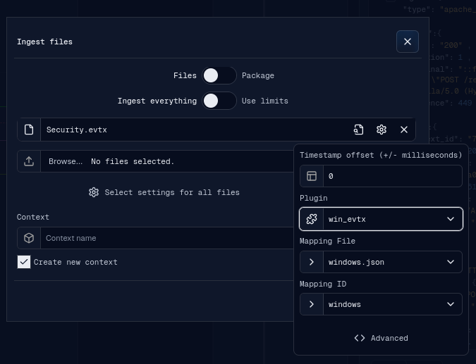
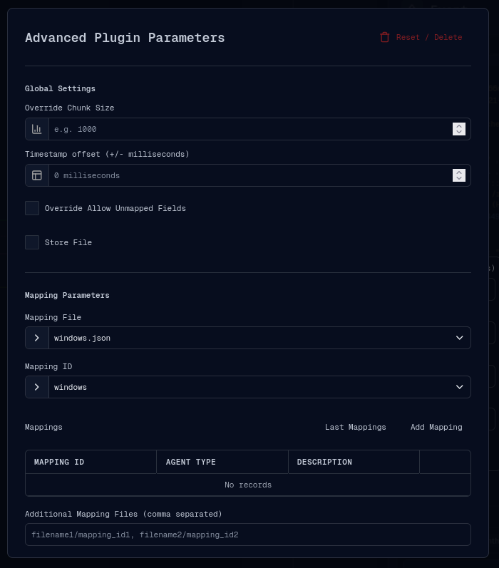

# Ingestion

The ingestion process adds local files or zipped packages to the selected
operation. Open it from the operation menu with **Upload files**.

## Basic Workflow

1. Choose the ingest mode:
   - **Files**: ingest one or more individual files and configure parser settings
     per file.
   - **Package**: ingest a zip package. In package mode, the file picker accepts
     zip files and per-file parser settings are not shown in the same way.
2. Choose the time scope:
   - **Ingest everything**: ingest all events found in the selected files.
   - **Use limits**: enable a custom frame so ingestion is limited to a chosen
     time range.
3. Select one or more files with **Browse**.
4. Select or create the context:
   - Keep **Create new context** enabled to type a new context name.
   - Disable it to select an existing context from the operation.
5. Configure parser settings for each file, or use **Select settings for all
   files** to apply one configuration to every selected file.
6. Confirm with the check button. When submission starts, gulpui-web opens the
   source selection banner so the newly ingested sources can be selected into the
   timeline after they are available.

The confirm button stays disabled until a context, at least one file, and valid
file settings are present.

## Per-File Settings

In **Files** mode, each selected file has a settings control. The app tries to
detect a plugin from the file signature and may preselect the parser, mapping
file, and mapping ID when only one valid option exists.

Common file settings:

- **Timestamp offset**: shifts timestamps by positive or negative milliseconds
  during ingestion.
- **Plugin**: selects the ingestion parser, such as `win_evtx`.
- **Mapping File**: selects the mapping file/method exposed for the parser.
- **Mapping ID**: selects the mapping inside the mapping file.
- **Advanced**: opens the full advanced plugin parameter dialog.

If the selected plugin requires a mapping file or mapping ID, ingestion settings
are considered valid only after those values are selected. Custom mappings in
advanced parameters can also satisfy mapping requirements.

## Settings for All Files

Use **Select settings for all files** when several files should share the same
parser configuration. The settings popover lets you choose the plugin, mapping
file, mapping ID, offset, custom parameters, and advanced options once, then
apply them to all currently selected files.

This is useful when a group of files comes from the same source type, for example
several EVTX files that should all use the same Windows mapping.

## Advanced Plugin Parameters

The advanced dialog is shared by ingestion, external query, and bridge-task
configuration. For ingestion, it expands the parser configuration beyond the
basic plugin/mapping fields.

Global settings:

- **Override Chunk Size**: override the backend chunk size used while processing
  the file.
- **Timestamp offset (+/- milliseconds)**: set the same offset through the
  advanced parameter payload.
- **Override Allow Unmapped Fields**: allow fields that are not present in the
  selected mapping.
- **Store File**: available when the caller enables this option; stores the
  original file according to backend support.

Mapping parameters:

- **Mapping File**: select the parser method or mapping file.
- **Mapping ID**: select the mapping inside the selected mapping file.
- **Mappings**: define custom mapping objects directly in the UI.
- **Last Mappings**: load mappings previously saved locally for this plugin.
- **Add Mapping**: create or edit a mapping object and optionally upload it.
- **Additional Mapping Files**: provide extra mapping references as a
  comma-separated list.
- **Additional Mappings**: add supplemental mapping objects.
- **Sigma Mappings**: map Sigma service fields and values when the plugin uses
  Sigma-compatible mapping data.

Custom parameters:

- In automatic mode, the UI renders fields from the selected plugin metadata.
- In textarea mode, advanced JSON parameters can be entered directly.

Press **Apply Changes** to copy the advanced configuration back to the ingest
file settings. Press **Reset / Delete** to clear the advanced configuration for
that file or shared settings group.

## After Ingestion

Ingestion runs asynchronously. Progress is tracked per selected file, and source
selection should be refreshed after backend processing completes. Once new
sources appear, select them in the source selection banner and continue with the
normal [Flow](flow.md).
