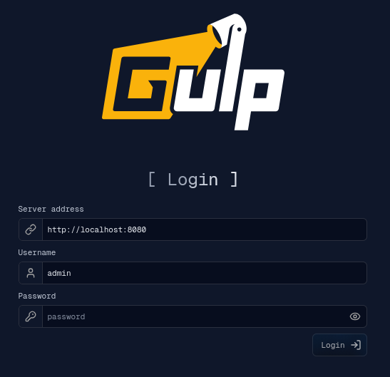

# Installation

gulpui-web is a React and TypeScript frontend for the gULP platform. It connects
to a running gULP backend from the login page.



## Requirements

- Node.js `22.14.1`
- pnpm `10.8.1`
- A reachable gULP backend server

## Install Dependencies

Clone the repository and install dependencies:

```bash
git clone https://github.com/mentat-is/gulpui-web
cd gulpui-web
pnpm install
```

If pnpm blocks dependency build scripts, approve the required scripts:

```bash
pnpm approve-builds
```

## Run for Development

Start the React development server:

```bash
pnpm start
```

Open the printed local URL in a browser. On the login page, enter the backend
server address, username, and password.

## Build for Deployment

Create a production build:

```bash
pnpm run build
```

Serve the generated `build/` folder with the bundled static server:

```bash
pnpm run server
```

The `server` script serves `build/` on port `80`. You can also deploy the
contents of `build/` with any static web server.

## Current Scripts

- `pnpm start`: run the development server.
- `pnpm run build`: create a production build.
- `pnpm run server`: serve the production build from `build/`.
- `pnpm run check:locales`: validate locale fallback coverage.

## Paid Plugin Copy Step

The `prestart` and `prebuild` scripts run `scripts/copy_paid_plugins.js`. If a
local paid-plugin repository is not present, the script logs that no paid UI
plugins were found and exits successfully. Paid/pro plugin documentation is not
included in this documentation set.
