## Workflow
After login, the user is redirected to the **Workflow**, which is the central area of Gulp Web Client.  

  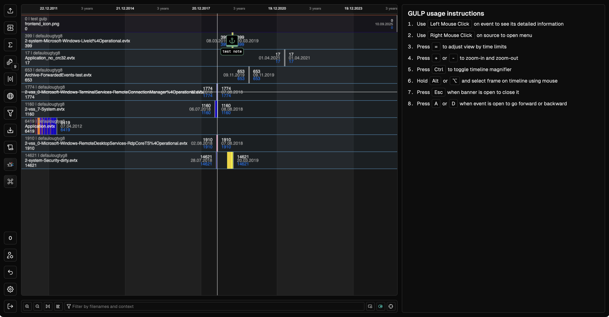

## The workflow contains three main zones:

- [Center-Panel](#center-panel) 
- [Right-Panel](#right-panel)     
- [Left-Panel](#left-panel)

---

## Center-Panel

Displays **sources** in a timeline-like structure: each *source* belongs to a **context** and contains one or more documents (**events**).
Events are arranged chronologically and can be clicked to view details.

>**Tip**
>some basic Gulp terminology:
>`context`: a **container** grouping different `sources` (i.e. a **host** involved in the incident being analyzed).
>`source`: the entity containing the **events** (i.e. a **file** ingested during the analysis).

---
#### Timeline Overview

The timeline visualization provides a structured view of system log data over a defined period. Each horizontal row corresponds to a specific log file or data source, showcasing activity through color-coded bars and graphical overlays. This helps quickly identify patterns, correlations, and areas requiring attention.

  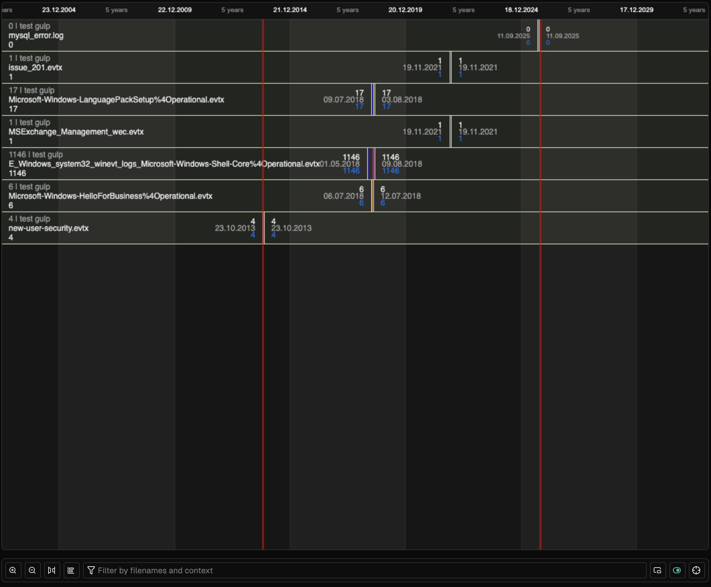

---

#### Components

**Time Scale**  
- Located at the top of the timeline.  
- Divides the timeline into intervals (e.g., 10-day spans).  
- Facilitates precise navigation and event identification within the selected period.

---

**Rows and Data Sources**  
- Each row corresponds to a specific log file (e.g., `Security.evtx`, `System.evtx`).  
- The log file name and unique identifier are displayed on the left side.  
- **Example Rows:**  
  - `Microsoft-Windows-Ntfs%4Operational.evtx` logs file system operations.  
  - `Security.evtx` records security-related events.

---

**Color-Coded Activity**  
- **Yellow Bars**: Indicate significant or high-intensity activity.  
- **Purple Bars**: Represent less intensive or background processes.  
- Helps highlight priority areas for investigation.

---

**Graphical Overlays**  
- Lines with nodes and numerical labels represent metrics (e.g., event counts).  
- Peaks and valleys show fluctuations in activity.  
- **Example:** A peak labeled `2625` in `Microsoft-Windows-Ntfs%4Operational.evtx` indicates a high volume of events.

---

**Event Markers**  
- Icons pinpoint specific events or milestones.  
- Custom markers denote key system states or anomalies.  
- **Example:** A marker at `2024/07/18` aligns peaks in `System.evtx` and `Microsoft-Windows-SMBServer%4Operational.evtx`.

---

## Timeline Interactions

**Right-Click on a Timeline Item**  
When you right-click a log entry (e.g., `new-user-security.evtx`), a context menu appears.

  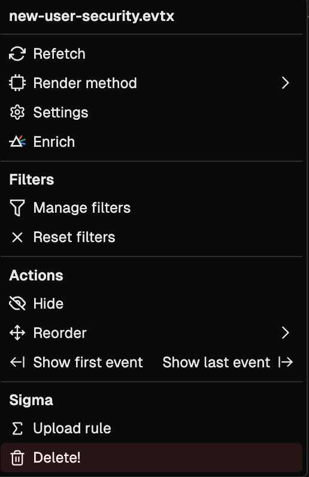

---
### The following options:

#### Global section
This section provides global controls for the selected log file in the timeline.  

- **Refresh**  
  Reloads the selected log file.  
>**Note**
> Any notes or annotations you added will be preserved.

- **Render Method**  
  Choose how the log is visualized:  
  - **Default**: Standard timeline view  
  - **Heat Map**: Highlights activity intensity using colors  
  - **Graph**: Displays relationships between events

- **Settings**  
  Customize timeline visualization:  
  - **Offset**: Adjust the position of events on the timeline  
  - **Render Options**: Switch between visualization styles  
  - **Color Palette**: Change bar and graph colors  
  - **Target File ID**: Modify which file the settings apply to

- [Enrich](#data-enrichment)

#### Filters Section

Within the timeline context menu, the **Filters** section allows you to create, manage, and reset filters for the selected log or data source.  

- **Manage Filter**  
  Opens the filter management interface, where you can edit existing filters, add new conditions, and apply them to the current timeline view.  
  > **Note:** Changes are applied immediately, and the timeline updates to reflect filtered events.

- **Reset Filter**  
  Clears all active filters for the selected log, restoring the full timeline view.  
  > **Note:** Any unsaved filter configurations will be lost, so make sure to save them if needed.

#### Actions Section
The **Actions Section** provides controls to manage how events and logs are displayed in the timeline.  

**Hide / Show Items**  
- Temporarily hide selected logs or events from the timeline view.  
- Use this to focus on relevant data without removing items permanently.

**Reorder**  
- **Pin**: Keep important logs or events fixed at the top of the timeline.  
- **Move Up / Down**: Change the order of events within the timeline for better organization.

**Navigation**  
- **Go to First Event**: Instantly jump to the earliest event in the timeline.  
- **Go to Last Event**: Quickly navigate to the most recent event.  

> **Note:** Reordering, hiding, or pinning items affects only the current session view and helps maintain a clear and organized timeline UI.

#### Sigma Rules Section

The **Sigma Rules Section** allows you to apply detection rules to logs directly from the timeline.  
Here you can upload new rules or delete existing ones.

**[Upload Rule](#sigma-rules)**  
- Add a new Sigma rule to the selected log or timeline event.  
- Once uploaded, the rule will be applied to the relevant events and reflected in the timeline visualization.

**Delete**  
- Remove an existing file from the workspace.

> **Note:** Deleting a file is **cascading** — all data, queries, and visualizations associated with this file will also be removed from the workspace.

> **Tip:** Be cautious when deleting files. Any unsaved changes linked to the file will be lost permanently.

---

#### Bottom Panel
At the very bottom of the **Event Details View**, an additional panel is available for extended controls:

- **Filter by File Names and Context** — quickly narrow down visible events.
- **Open Notes Banner** — launches a dedicated notes window.
- **Zoom Controls** — zoom in/out on the timeline for closer or broader views.
- **Reset Scale** — reset the timeline to its default view, restoring the original event distribution.
- **Toggle Notes & Links Visualization** — switch the display of notes and links on the timeline on or off.

>**Note**
>Disabling **Notes & Links Visualization** does not delete or hide notes/links permanently — it only removes them from the timeline view. This helps maintain a clean workspace when working with a large number of notes and links.

	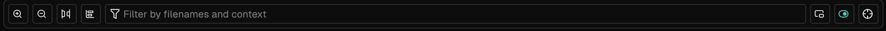

---

##### Notes Banner

Clicking **Notes Banner** opens a separate window (not a browser tab, but a mini in-app window similar to the registration dialog with `about:blank`).

In this window, you can:

- View **all existing notes**.
- **Search notes** by title or description.
- Filter notes by **tags**.

>**Tip**
>The Notes Banner helps organize multiple notes across events and quickly find specific annotations when working with large log sets.

---
## Right-Panel

The **Right Panel** serves two purposes depending on the current context.

#### Default State — Usage Instructions
By default, the panel displays **usage instructions** and a list of **keyboard shortcuts**.  
This helps users quickly learn how to navigate and interact with the timeline.

  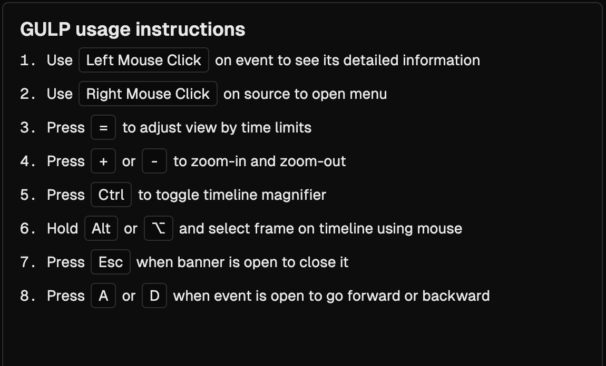

---

#### Log Events List
When the user clicks on any log within the timeline, the **Right Panel** first displays a **list of all events** that occurred in the selected time range.

 
	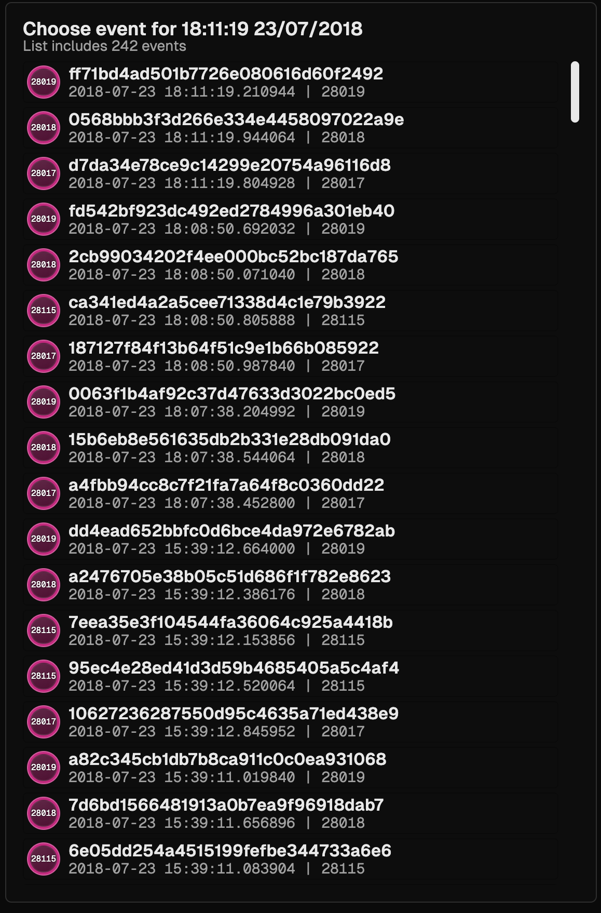 

---

#### Event Details View 
After selecting a specific event from the list, the **Right Panel** switches to the **event details view**.

 
	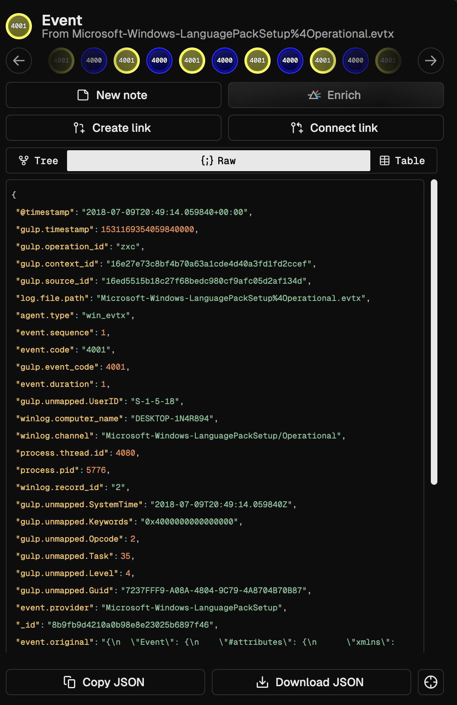 

---

#### Create Notes
Clicking **Create Note** opens a note creation panel. In this panel, you can:

- Set an **event title** (required).
- Choose an **icon** and **color** for the note.
- Add **tags** for easier filtering.
- Define visibility:
    - **Public** (default).
    - **Private** (visible only to you).
- Write a **description** for additional context.

 
	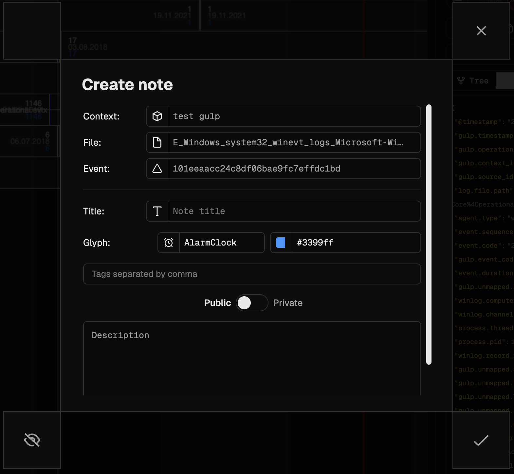 

---

#### Note Management

After a note is created, it appears in the **Notes Section** on the right panel.

In this section, you can:

- **Edit** an existing note (change title, tags, color, visibility, description).
    
- **Delete** a note permanently.
    
- **Switch** between different notes if multiple exist for the same event.
    

 
	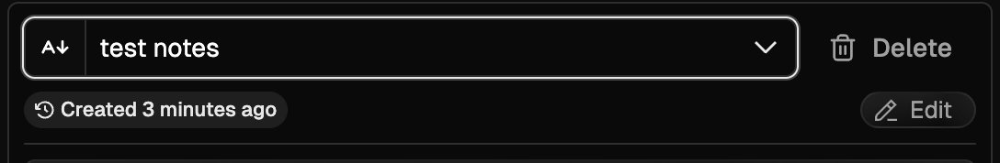

>**Note**
>Deleting a note is **permanent** — it cannot be restored once removed.

---
#### [Enrichment Tools](#data-enrichment)
The **Enrichment Tools** provide additional context and data for the selected event.

---
#### Create Links
You can create new links or connect the current event to an existing one.  
This feature helps to visualize relationships between logs and build structured timelines.

When creating a new link, a configuration panel opens. In this panel, you can:

- Provide a **Title** for the link.
- Add a **Description** (optional).
- Choose an **Icon** to represent the link.
- Select a **Color** for easier visual grouping.

 
	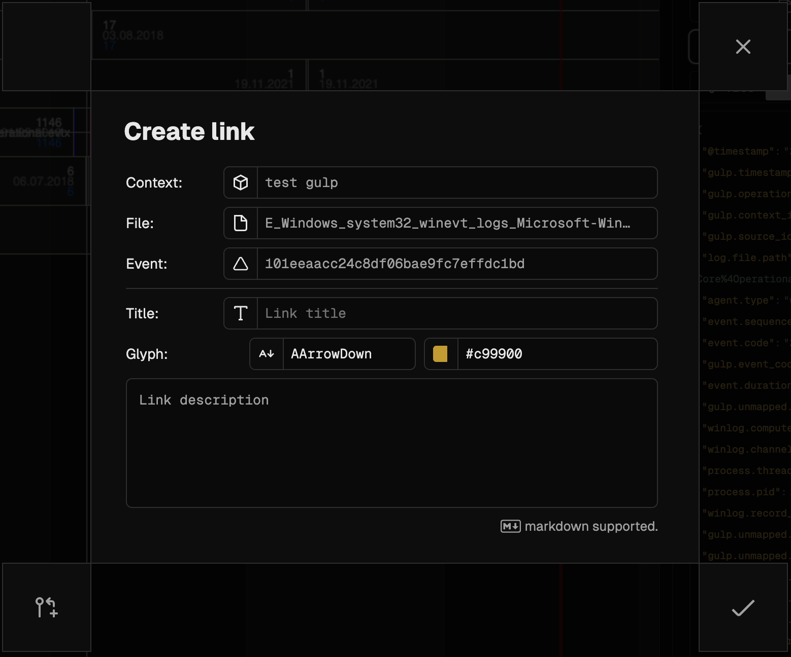

>**Note**
>Once created, the link can be reused and attached to other events, forming a connected chain of related logs.

---
#### Connect Link
The **Connect Link** option allows you to attach the current event to an already existing link.

- When you press **Connect Link**, a panel opens showing all available links.
- If no links exist, the panel suggests creating a new one.
- Selecting a link will connect the current event to it.

	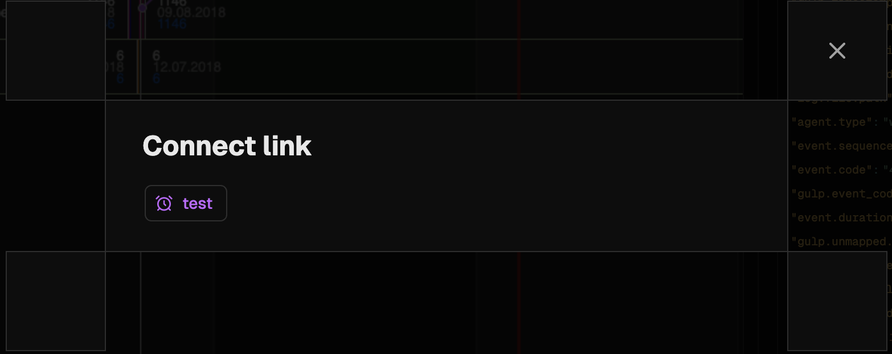 

Once connected, the link is displayed on the **timeline**, clearly showing the relationship between events.

 
	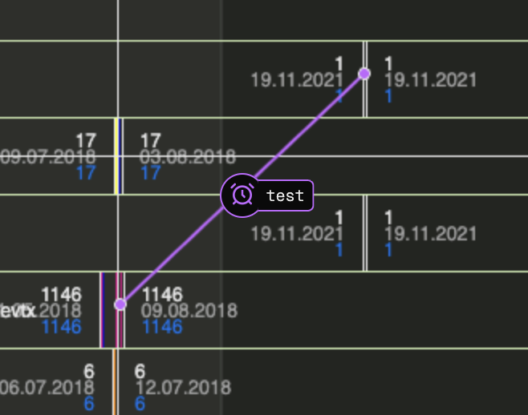 

---

#### Data Display Modes

In the lower part of the **Event Details View**, the raw event data can be displayed in multiple formats:

- **Tree** — structured tree view for easier navigation.
- **JSON (default)** — raw JSON representation of the event.
- **Table** — tabular format for quick comparison of key values.

After choosing the display mode, you can also:

- **Copy** the full JSON to clipboard.
- **Download** the JSON as a file.

>**Tip**
>Switching between display modes does not affect the underlying event data. It only changes how the data is visualized for easier analysis.

---
## left-Panel

The **Left Sidebar** provides access to all workspace management actions. Each button opens a dedicated panel or tool.

- [Upload-Files](#upload-files)
- [Queries](#queries)
- [Sigma-Rules](#sigma-rules)
- [File-Management](#file-management)
- [TimeFrame](#timeframe)
- [Global-Queries](#global-queries)
- [Filters](#filters)
- [Export](#export)
- [Data-Enrichment](#data-enrichment)
- [Commands](#commands)
- [Requests-List](#requests-list)
- [Permissions](#permissions)
- [Switch-Operation](#switch-operation)
- [Settings](#settings)
- [Logout](#logout)

---
### Upload-Files
Allows you to upload files and attach them to the current operation. 

- Assign a **context name** (available once you press *Create new context*).  
- Choose a file from your local system.  
- Set optional **limits** if needed. 

  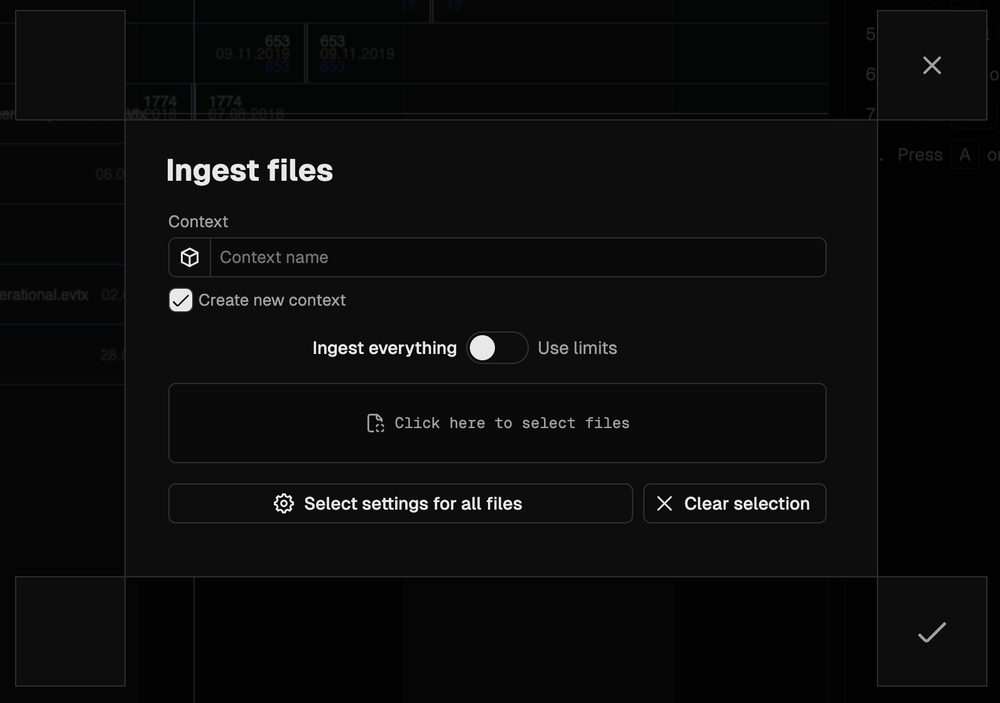

---
### Queries
Manage existing queries or create new ones. Queries allow you to filter and extract data from logs more efficiently.

- Use existing queries to quickly analyze logs.  
- Create new queries tailored to your investigation.  
- Edit or refine queries to adapt them to specific contexts.  
- Save queries for reuse across different operations.  

  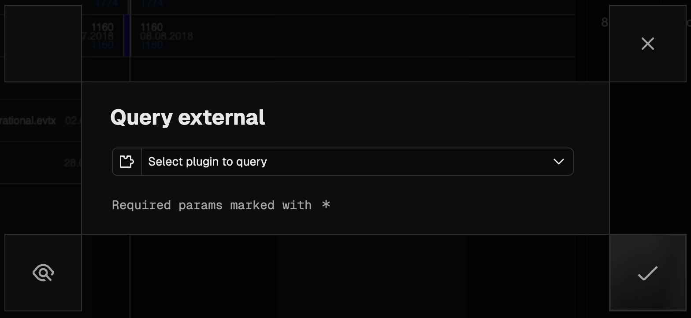

---
### Sigma-Rules
Apply Sigma rules to logs or files.  

- Select a file for applying rules.
- Execute Sigma detection rules on the selected data.

  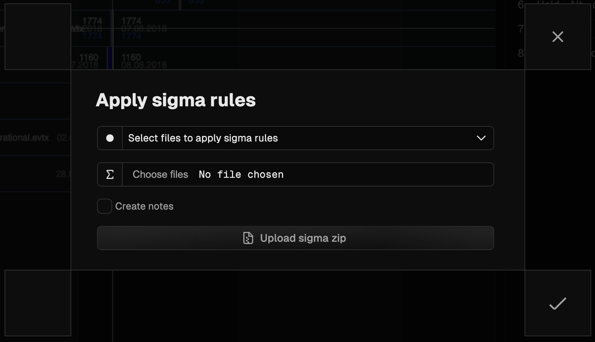

---
### File-Management
Manage files and logs attached to the current operation.

- Upload new files and give them a **context name**.
- Update existing files.
- Delete files no longer needed.

  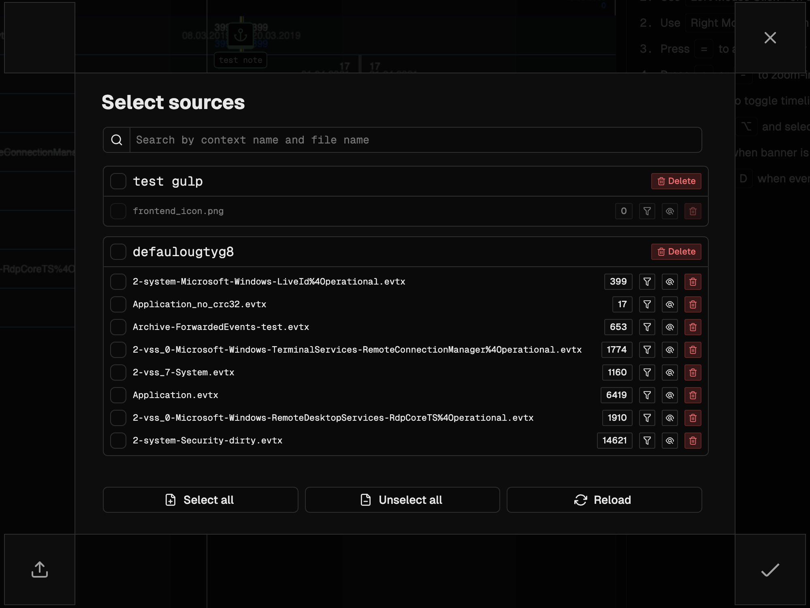

---
### TimeFrame
Manage the timeframe of the current operation.

- Change the workflow frame.
- Modify workflow-related global queries.
- Apply filters to queries.

  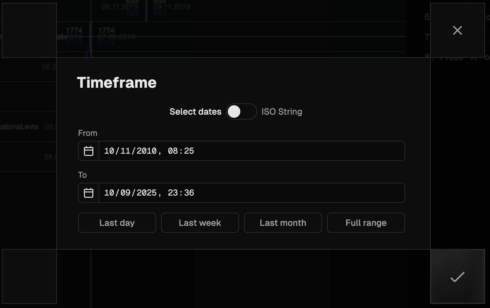

---
### Global-Queries
Create and manage custom queries manually.

- Write your own queries from scratch.
- Add **conditions** to refine query results.
- Apply these queries to the logs and files in the workspace.

  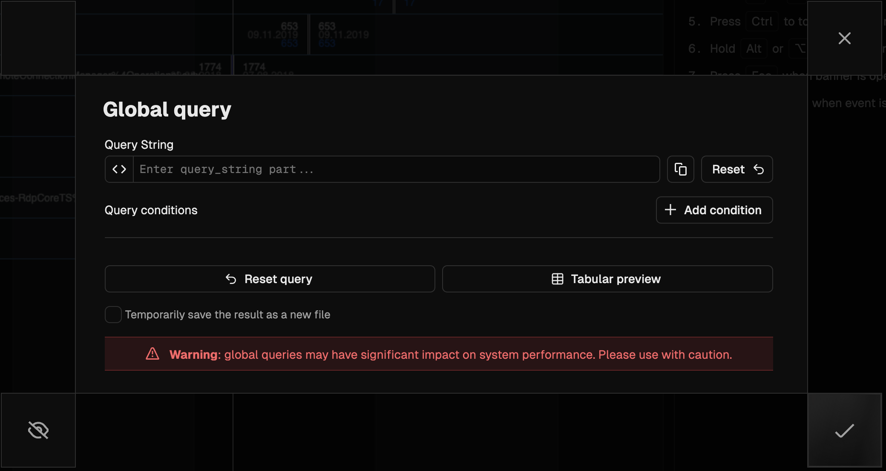

>**Note**
>Use global queries carefully, as they can affect the behavior of the program. 
>Make sure to test queries and conditions before applying them to critical data.

___
### Filters
Create and apply filters to specific files.

- Select a file to which the filter should be applied.
- Create a new filter with multiple **conditions**.
- Save filters for future use.
- Apply saved filters to quickly refine data in the center panel.

  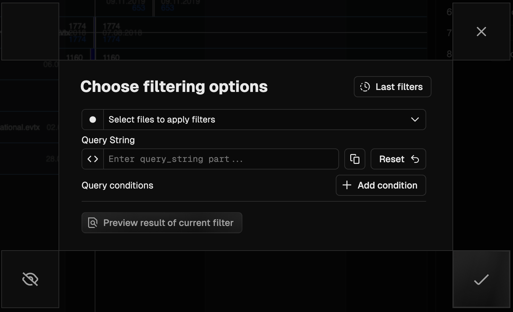

---

### Export
Export the current operation in various formats.

- Export data from the workspace in different formats, from **SVG** to **JSON**.
- Choose the desired format depending on how you want to use or share the data.
- Save exported files for further analysis or reporting.

  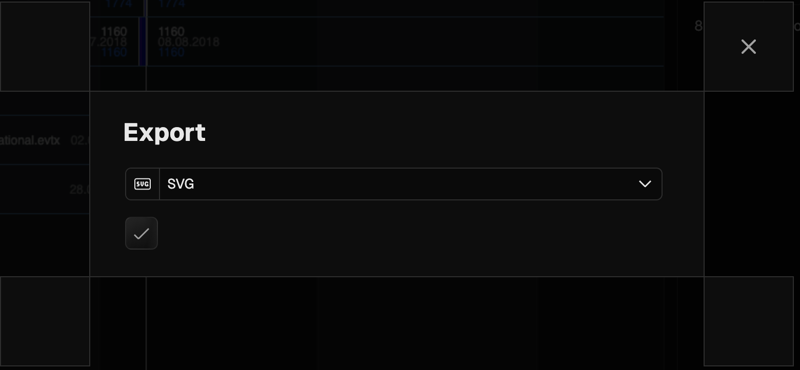

---
### Data-Enrichment
Enrich log data using selected plugins.

- Choose the **plugins** you want to use for data enrichment.
- Select the **source data** that you want to enrich.
- Apply enrichment to enhance logs with additional context or information.

  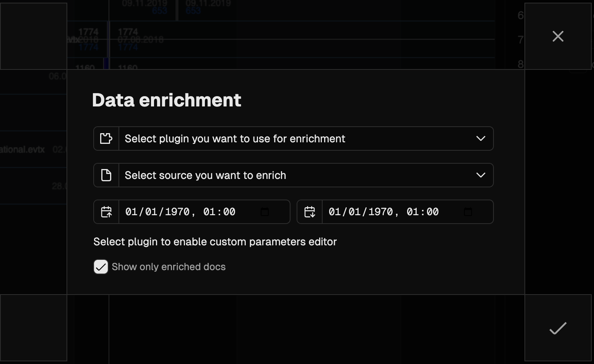

---
### Commands
View and execute all available commands in the workspace.

- See all commands and panels listed above in one place.
- Execute any command from the workspace directly.

  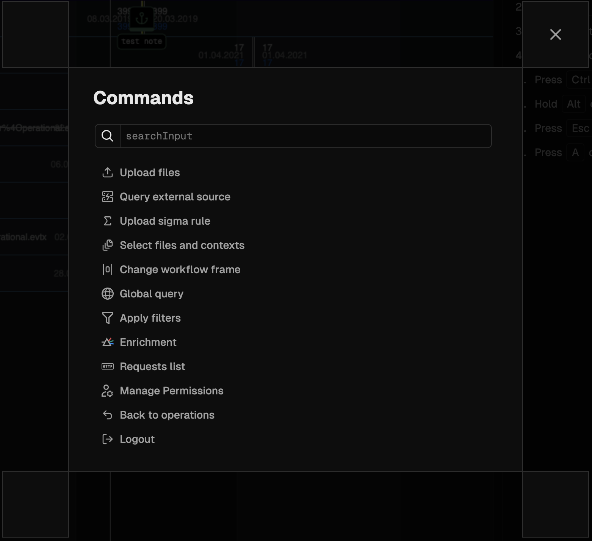

>**Note**
>Quickly access functions from *Queries, File Management, Workflow Frame, Sigma Rules, Time Frame, Global Queries, Filters, Export, and Data Enrichment.*

---
### Requests-List
Monitor and manage operation requests and their statuses.

- View all requests associated with the current operation.
- Check the **status** of each request, indicating whether it completed successfully or failed.
- Take appropriate actions based on the request results.

  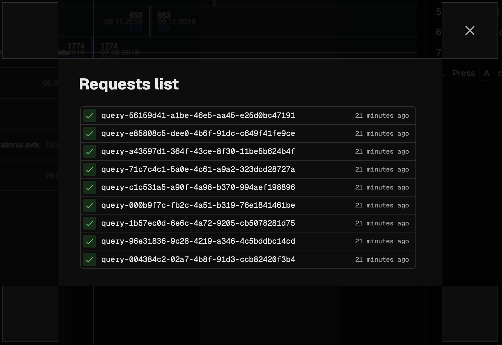

---

### Permissions
Manage user access and permissions for the workspace.  

- Assign different **permissions** to users.
- Create **groups** to organize users with similar access levels.
- Set **usernames and passwords** that users can use to log in.
- Control who can view, edit, or manage specific operations.

  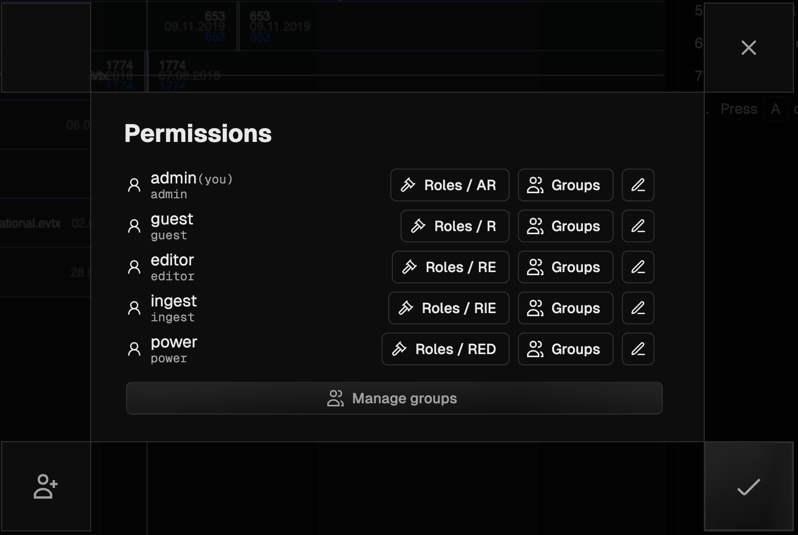

---
### Switch-Operation
Switch between different operations in the workspace.  

- Select another operation to work on.
- Quickly navigate between multiple ongoing operations.
- Ensure that actions, queries, and file management apply to the selected operation.

---

### Settings
Access workspace settings and customize various options. 

- Change **local time** settings to UTC or vice versa.
- Adjust **scroll type**, such as reverse scrolling.
- Configure other workspace preferences for better usability.

---
### Logout

End the current session and optionally save it.  

- Open the **session save panel** before logging out.
- Choose a **name**, **color**, and **icon** for the session if you want to save it.
- You can also choose **not to save** the session.

  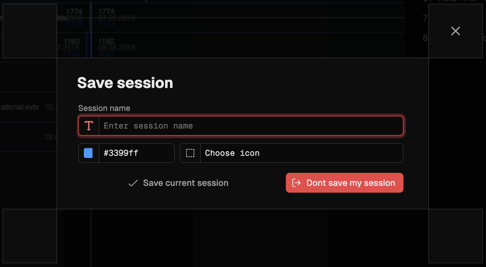

>**Note**
>Sessions are saved automatically, but to avoid losing the previous autosave, it is recommended to manually save the session before logging out.