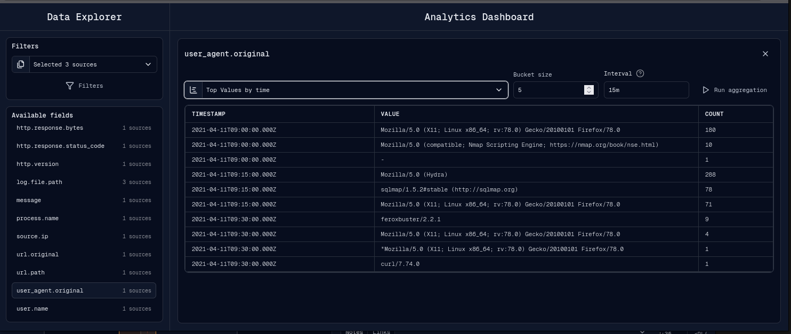
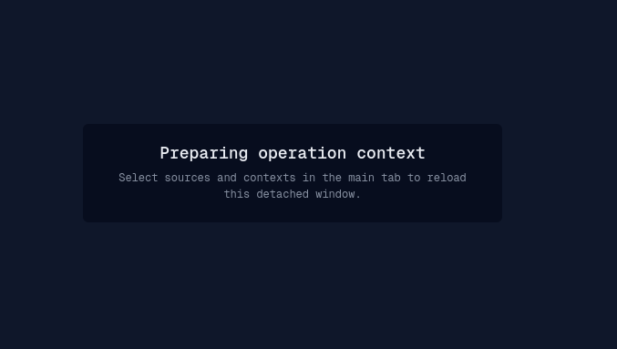

# View

The View area contains event detail, notes, source event tables, dashboards, and
detached windows.

## Event Detail

Event Detail opens when an analyst selects an event on the timeline or from a
table/list view.

The event detail view provides:

- event navigation across nearby events;
- raw JSON view;
- table view;
- tree view;
- copy/download JSON actions;
- flag and target actions;
- enrichment actions;
- Send IOC when a `send-data` plugin is available;
- plugin-provided event actions;
- Notes and Links tabs.

The event panel can be docked inside the operation workspace or opened as a
detached dialog window.

## Notes Window

The detached Notes window gives a table-level view of operation notes.

It supports search, tag selection, visible-source filtering, row targeting, row
deletion, multi-select, and bulk deletion.

If a note targets an event that is not currently loaded in the main timeline, the
main tab can fetch that event before opening its detail dialog.

## Source Events Table

The Table View window displays source events in a paginated table.

Table View supports:

- selecting a source;
- synced mode, which follows global filters and timeline range;
- detached mode, which uses local search and independent time filters;
- local structured filters;
- sortable fields;
- page size and pagination;
- selecting visible rows;
- creating notes from selected events;
- opening target events in the main tab.

## Dashboard

The Dashboard window combines a Data Explorer sidebar with fixed dashboards and
ad-hoc field aggregation.

Fixed dashboard cards are based on dashboard definitions and selected sources.
The visible dashboard examples include global event rate and log source
distribution.

Ad-hoc aggregation lets an analyst pick an available field and run top values,
top values by time, or rare values.

Aggregation controls include bucket size, max document count, result size, and
date histogram interval. Interval values are resolved as either calendar or fixed
OpenSearch date histogram intervals.

## Detached Windows

Notes, Table View, Dashboard, and event dialogs can run in separate browser
windows. Detached windows receive operation snapshots, selected source IDs,
selected events, theme changes, and lifecycle messages from the main tab.

Common detached-window waiting states:

- `Preparing operation context`: the main tab is on an operation route but the
  detached window has not received selected sources yet.
- `Waiting for an operation`: the main tab is outside an operation.
- `Login required`: the session is missing or rejected.

## Troubleshot

If the main tab is hard-reloaded and a detached window remains stuck preparing
context, close and reopen that detached window from the operation menu.
